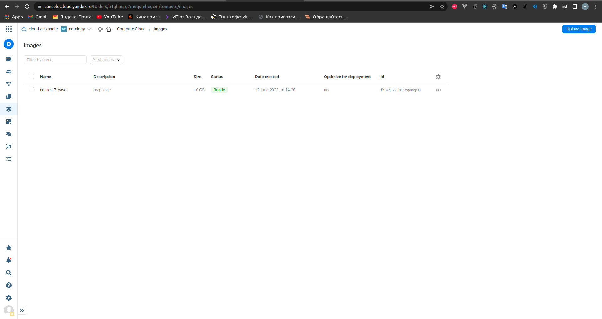
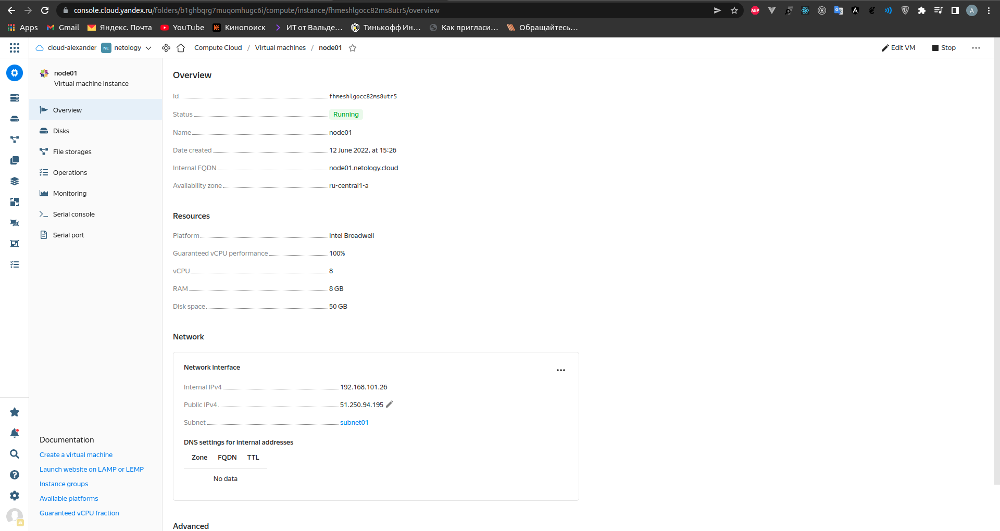
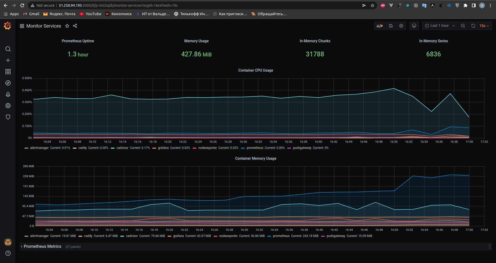
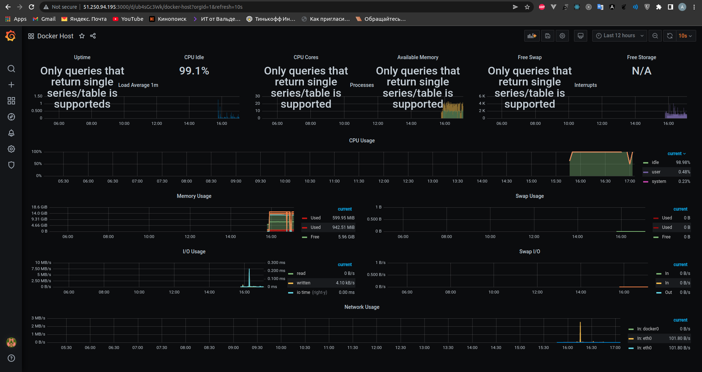
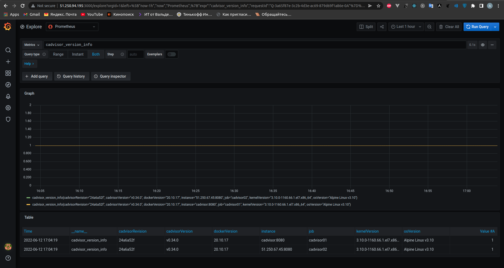

# Домашнее задание к занятию "5.4. Оркестрация группой Docker контейнеров на примере Docker Compose"

## Задача 1

Создать собственный образ операционной системы с помощью Packer.

Для получения зачета, вам необходимо предоставить:
- Скриншот страницы, как на слайде из презентации (слайд 37).

Решение:

## Задача 2

Создать вашу первую виртуальную машину в Яндекс.Облаке.

Для получения зачета, вам необходимо предоставить:
- Скриншот страницы свойств созданной ВМ, как на примере ниже:

Решение:


## Задача 3

Создать ваш первый готовый к боевой эксплуатации компонент мониторинга, состоящий из стека микросервисов.

Для получения зачета, вам необходимо предоставить:
- Скриншот работающего веб-интерфейса Grafana с текущими метриками, как на примере ниже

Решение:


## Задача 4 (*)

Создать вторую ВМ и подключить её к мониторингу развёрнутому на первом сервере.

Для получения зачета, вам необходимо предоставить:
- Скриншот из Grafana, на котором будут отображаться метрики добавленного вами сервера.

По этому заданию возникли трудности, не получается грамотно получить метрики практически никакие, хотя инфу со второго сервера можно получить, например версию cadvisor. 
Проблема примерно такая:

Конфиги:
docker-compose.exporters.yaml
```
version: '2.1'

services:

nodeexporter:
image: prom/node-exporter:v0.18.1
container_name: nodeexporter
volumes:
- /proc:/host/proc:ro
- /sys:/host/sys:ro
- /:/rootfs:ro
command:
- '--path.procfs=/host/proc'
- '--path.rootfs=/rootfs'
- '--path.sysfs=/host/sys'
- '--collector.filesystem.ignored-mount-points=^/(sys|proc|dev|host|etc)($$|/)'
restart: unless-stopped
network_mode: bridge
ports:  [ "9100:9100" ]
expose: [ "9100" ]
labels:
org.label-schema.group: "monitoring"

cadvisor:
image: gcr.io/google-containers/cadvisor:v0.34.0
container_name: cadvisor
volumes:
- /:/rootfs:ro
- /var/run:/var/run:rw
- /sys:/sys:ro
- /var/lib/docker/:/var/lib/docker:ro
- /cgroup:/cgroup:ro
restart: unless-stopped
ports:  [ "8080:8080" ]
expose: [ "8080" ]
network_mode: bridge
labels:
org.label-schema.group: "monitoring"
```
prometheus.yml
```
global:
  scrape_interval:     15s
  evaluation_interval: 15s

  # Attach these labels to any time series or alerts when communicating with
  # external systems (federation, remote storage, Alertmanager).
  external_labels:
      monitor: 'prometheus'

# Load and evaluate rules in this file every 'evaluation_interval' seconds.
rule_files:
  - "alert.rules"

# A scrape configuration containing exactly one endpoint to scrape.
scrape_configs:
  - job_name: 'nodeexporter01'
    scrape_interval: 5s
    static_configs:
      - targets: ['nodeexporter:9100']

  - job_name: 'cadvisor01'
    scrape_interval: 5s
    static_configs:
      - targets: ['cadvisor:8080']

  - job_name: 'nodeexporter02'
    scrape_interval: 5s
    static_configs:
      - targets: ['51.250.67.45:9100']

  - job_name: 'cadvisor02'
    scrape_interval: 5s
    static_configs:
      - targets: ['51.250.67.45:8080']

  - job_name: 'prometheus'
    scrape_interval: 10s
    static_configs:
      - targets: ['localhost:9090']

  - job_name: 'pushgateway'
    scrape_interval: 10s
    honor_labels: true
    static_configs:
      - targets: ['pushgateway:9091']

  - job_name: 'alertmanager'
    scrape_interval: 10s
    honor_labels: true
    static_configs:
      - targets: ['alertmanager:9093']

  - job_name: 'grafana'
    scrape_interval: 10s
    honor_labels: true
    static_configs:
      - targets: ['grafana:3000']


alerting:
  alertmanagers:
  - scheme: http
    static_configs:
    - targets:
      - 'alertmanager:9093'

```
provision.yml
```
---

  - hosts: nodes
    become: yes
    become_user: root
    remote_user: centos

    tasks:
      - name: Synchronization
        copy:
          src: stack/exporters
          dest: "/opt/stack"
          owner: root
          group: root
          mode: 0644
        become: true

      - name: Up all services in compose
        command: docker-compose -f /opt/stack/exporters/docker-compose.exporters.yaml up -d

```
Получилось подключить вторую виртуалку, но метрики все сбитые. Решение:



### Как cдавать задание

Выполненное домашнее задание пришлите ссылкой на .md-файл в вашем репозитории.

---
